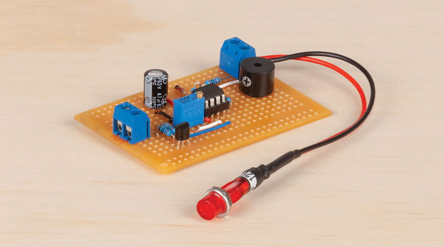

# Low Battery Alarm
 Simple alerts with the low battery alarm

 <github> View this project how it was meant to be displayed at https://jaycar.com.au/low-battery-alarm </github>

Perfect for 12 - 24V boating applications! Use this adjustable low voltage alarm for your next time out and about to make sure you're never stuck with low power again. Uses a 2.5v reference with the 358 Dual op-amp to compare the battery voltage and to oscillate a small buzzer on the board if it gets too low. Wire in a small LED indicator light so you can see it on your dash

You will need some spare wire to connect to battery and LED.

## What it does

This essentially hooks onto the battery and gives you two outputs when the battery goes below a certain level:

1. constant 12V HIGH
2. pulsing ground connection. (used for grounding the buzzer and making the alarm.)

With this, the idea is that you can hook it up to anything you want. for instance, a LED that warns you about "Low Voltage" could be connected on port 1. and the buzzer could be connected to port 2. or if you wanted a flashing LED and a constant tone, you'd connect the LED to 2. and a buzzer from 1. to ground.

## Bill of Materials

| Qty | Code                                     | Description                     |
| --- | ---------------------------------------- | ------------------------------- |
| 1   | [ZL3358](https://jaycar.com.au/p/ZL3358) | LM358 Dual Op amp IC            |
| 1   | [ZV1624](https://jaycar.com.au/p/ZV1624) | LM336Z precision 2.5v reference |
| 1   | [RR0596](https://jaycar.com.au/p/RR0596) | 10k resistors                   |
| 1   | [RT4650](https://jaycar.com.au/p/RT4650) | 10k 25turn trimpot              |
| 1   | [RE6110](https://jaycar.com.au/p/RE6110) | electrolytic cap 47uf           |
| 1   | [AB3459](https://jaycar.com.au/p/AB3459) | PCB buzzer                      |
| 1   | [HP9570](https://jaycar.com.au/p/HP9570) | Experimenters PCB               |
| 2   | [HM3172](https://jaycar.com.au/p/HM3172) | 2 way screw terminal            |
| 1   | [ZR1100](https://jaycar.com.au/p/ZR1100) | diode ZR1100                    |

## Instructions

For more information on how to build this kit, check out https://jaycar.com.au/low-battery-alarm

## Using the device

It might be easiest to connect it to a variable power supply, we use [MP3842](https://jaycar.com.au/p/MP3842) in the lab, but any adjustable power supply can do ( grab an [MP3844](https://jaycar.com.au/p/MP3844) while they're hot.)

The basic idea with calibrating the unit, is you want to give it a set voltage that you want to trigger at, for instance, 10V. Then adjust the [RT4650](https://jaycar.com.au/p/RT4650) potentiometer  until the buzzer sounds or the light turns on. Then that's it. if you put any higher voltage (ie: a full battery) it should appear "off" until the battery flattens to give the voltage that you specified.

### Troubleshooting and future improvements

- Play around with the circuit on falstad first to see how things work, then test for voltages on a multimeter. always triple check connections.
- If there's some issues when you hook up loads to the output, it's usually related to the output current of the op amps. I was able to light up an LED for this project but anything more like driving a relay might need some sort of MOSFET or otherwise to trigger it. Something like [ZT2466](https://www.jaycar.com.au/irf540n-mosfet-transistor/p/ZT2466) should work perfectly on the swinging output, and you'll have to get the equivalent on the constant positive output.
- The quickest change is to get this onto 24V systems, using a bigger voltage divider circuit so that the voltage range can drop lower. It wasn't investigated but it might just be introducing another 10k resistor on the input to comparitor A. Look up how to do voltage divider circuits and remember ohms law. 

