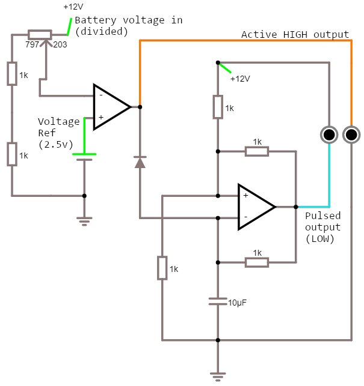
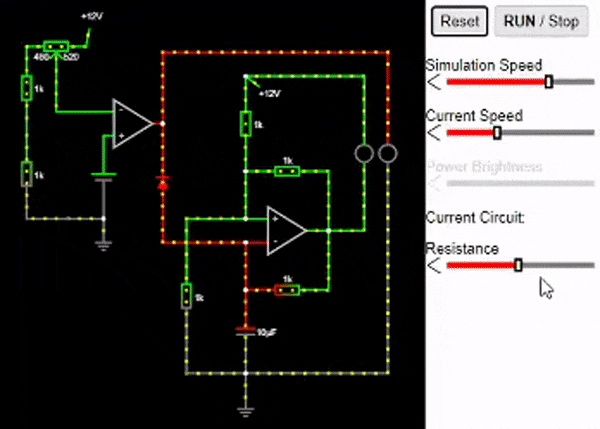
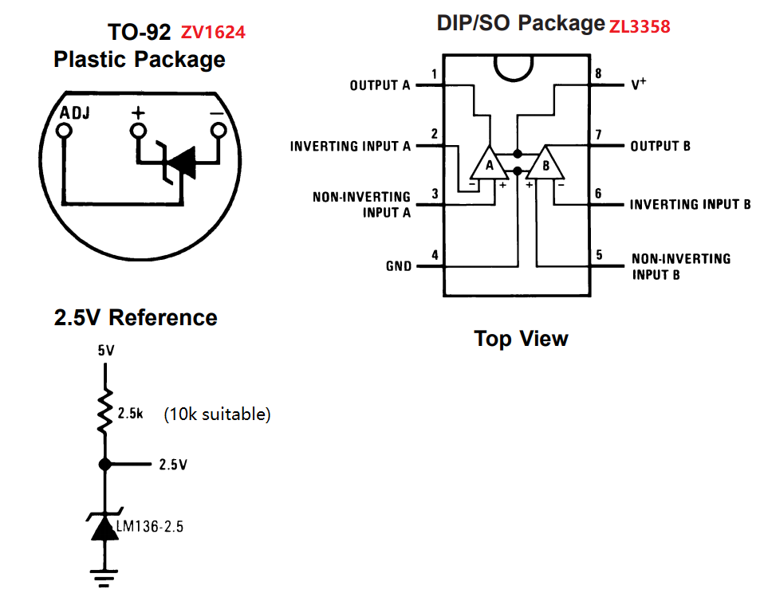
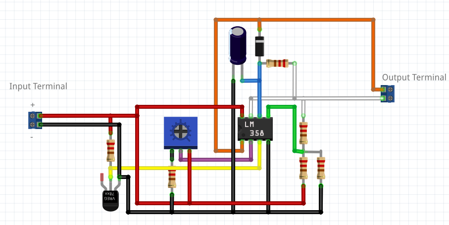
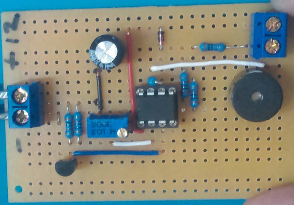

## Design

It's clear from the start that we're trying to COMPARE the battery level, and so we'll need a comparator to do that.

I had some idea that there was oscillator patterns online using a simple op-amp/comparitor circuit, so using a dual op-amp ({ZL335}) was going to be the way to go.

We ended up with a design chaining the two of them together like this:

There was a problem with this being `active low` which we tried to mitigate with using a 555 timer, but that involved too many components to be worthwhile.

## Prototyping

We played around with a falstad circuit here: [falstad.com](https://www.falstad.com/circuit/circuitjs.html?ctz=CQAgzCAMB0l3BWEB2aA2AjATmQDgWgsgEw6REgJJIAsYAUAIYjEEtthq7tohYgYkAWkED48ECJrQwyNHhzJZaOsWJ9YcZMizEaSrWPH0ATjwFzzNbpCOR6Ad3N7brXhkv2zbi707cPXlsMeEdwLl9w7h97Jx9iEnMwTihTJJT-cBTg0KdMn0zkoPoAY3TeHxprKChNeCwGxqbm-ikZOQVtZVViegBzK2rKrGK4tiqAywnUsYqaYMsXVLNAlnnI6Zy4MPjEjCqWRPsAEwEDhPV9mgEMdXVjgFMAM0YAVwAbABcd8e4aDF41XsAPU-0BfwBzhAjxeH0+QneD1OGBqthgkAwYSuN0uB0hsTO10h03x9BBIGm1Wm8WhzzeXwRSIEqNqGLCJMBVJsYXy40hMR+nL+VKB7KG4xF3IGKjWthlF1SHmuQnWf1sezstR0yBAACUHgBnACWBs+jAAdiUHmEZSManaCfL1vz1vZdVZorhuEcas71GjaggmCAZRhboScSAAsJRCFxMEMNAMF6+HZtgA3EPXJah4g2X22fgBmBBpzq-18UYCOa2FWuV30d2qincIRgCu2P0sktpOuyyR+gNxrwD4LEWvNrb2AD24FcBYaLDRdUgOEIaFYvrn4BYQV3O4AQoxPp8HiYAJ70IA) or you can scan this with your phone:

Nevermind the 1k resistors; we're using 10k in our project. 1k is just for example as it was the default resistor value when making the system.

Just to get the logic right; when the voltage of the battery drops below a certain level, we want one of the LEDs to light up, and one of the LEDs to blink. When the battery is high, we want them both to be off completely. It works fairly well, albeit with the negated logic on the second op-amp.

If you open up the link, you will be able to change the "resistance" on the right. If you change it to a low value, you should find the outputs we want flashing on the falstad applet.

## Assembling

Now comes to the meat of it. Start with the pinout:

[ZV1624](https://jaycar.com.au/p/ZV1624) voltage reference is just an easy 2 wire hookup, we're going to go for the attached diagram with the two pins (center and right). Don't worry about the *ADJ* for now, because we don't need it to be a precise voltage, just a voltage reference of some point value `X` which we then compare on the positive input of op amp `A`.

After a bit of experimentation we ended up a circuit that looks somewhat like this on paper:

We've colour coded the 

And it looks like this on the [HP9570](https://jaycar.com.au/p/HP9570) PCB:

The diagram on paper above wasn't quite able to match what we had on the PCB due to the size, and the PCB had some benefits such as the power rails coming down under the PCB which tided up a bit of the wiring. 

The only other thing is attaching the buzzer to it and trying it out. We have a [MP3842](https://jaycar.com.au/p/MP3842) power supply that we're able to adjust the voltage on and see how it works. 

The build from this point is nothing other than to put the parts together, if you want to see some step by step photos, we've got a bunch of photos in the project folder which you can download from the top of this page.
